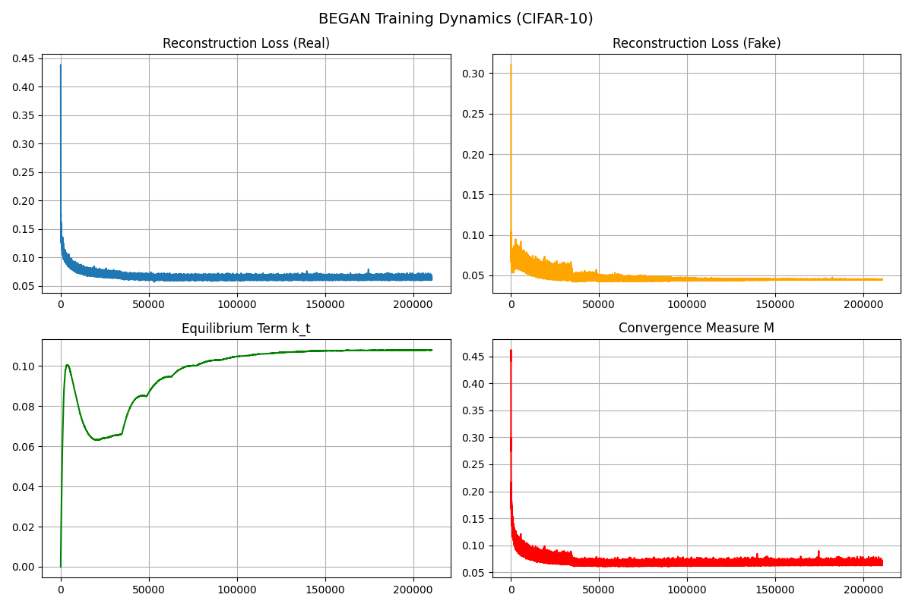
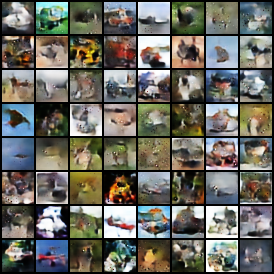

## BEGAN on CIFAR-10 (PyTorch)

Boundary Equilibrium GAN (BEGAN) reimplemented for 32x32 CIFAR-10 with a lightweight training loop, TTUR learning rates, optional EMA for the generator, and utilities for plotting/logging.

- **Dataset:** CIFAR-10 (downloads automatically)
- **Objective:** BEGAN equilibrium with reconstruction losses (L1) and \(k_t\) balance term
- **Hardware:** Trains comfortably on a single modern GPU; falls back to CPU

### Setup
- Install deps: `pip install -r requirements.txt`
- (Optional) set CUDA visibility: `export CUDA_VISIBLE_DEVICES=0`

### Train
```bash
python train.py \
  --epochs 60 \
  --batch-size 128 \
  --lr-g 2e-4 --lr-d 1e-4 \
  --ema \
  --run-name began_cifar10
```
Artifacts are written under `outputs/runs/<run-name>/`:
- `checkpoints/` - generator/discriminator weights (includes EMA if enabled)
- `samples/` - fixed-noise sample grids every `--save-every` epochs
- `logs/train_log.csv` - metrics for plotting

### Plot training curves
```bash
python plot_training.py \
  --log outputs/runs/<run-name>/logs/train_log.csv \
  --out outputs/began_training_curves.png
```

### Sample from a checkpoint
```bash
python sample.py \
  --ckpt outputs/runs/<run-name>/checkpoints/epoch_60.pt \
  --out outputs/sample_grid.png \
  --ema  # if you saved EMA weights
```

### Results
Training dynamics and an uncurated sample grid from the final generator (see `assets/` for the static copies):





### Notes
- Model definitions live in `models.py`; training loop and BEGAN \(k_t\) update are in `train.py`.
- Adjust `--gamma`, `--lambda-k`, and the `--d-steps`/`--g-steps` ratio to tune convergence speed and sample quality.
- Use `--tag` to label runs; metadata and config are stored in the run directory for reproducibility.
